# Jarkom-Modul-1-F04-2023

## Anggota Kelompok

1. 5025211149 - Irsyad Fikriansyah Ramadhan
2. 5025211158 - Ghifari Maaliki Syafa Syuhada

## Soal 1

User melakukan berbagai aktivitas dengan menggunakan protokol FTP. Salah satunya adalah mengunggah suatu file.

<ol type="a">
<li>
    Berapakah sequence number (raw) pada packet yang menunjukkan aktivitas tersebut? 
</li>

> 258040667

<li>
    Berapakah acknowledge number (raw) pada packet yang menunjukkan aktivitas tersebut?
</li>

> 1044861039

<li>
    Berapakah sequence number (raw) pada packet yang menunjukkan response dari aktivitas tersebut?
</li>

> 1044861039

<li>
    Berapakah acknowledge number (raw) pada packet yang menunjukkan response dari aktivitas tersebut?
</li>

> 258040696

</ol>

<hr style="width:60%;text-align:center">

> Filter packet dengan menggunakan query:<br>`ftp.request.command == "STOR"` 

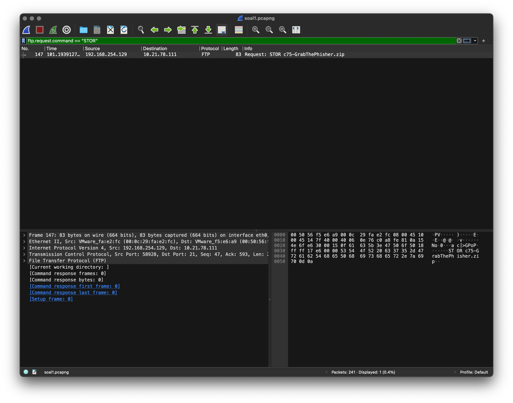

> Didapatkan nomor packet-nya 147, sequence number (raw) dan  acknowledge number (raw) dapat didapatkan dengan melihat detail dari packet tersebut

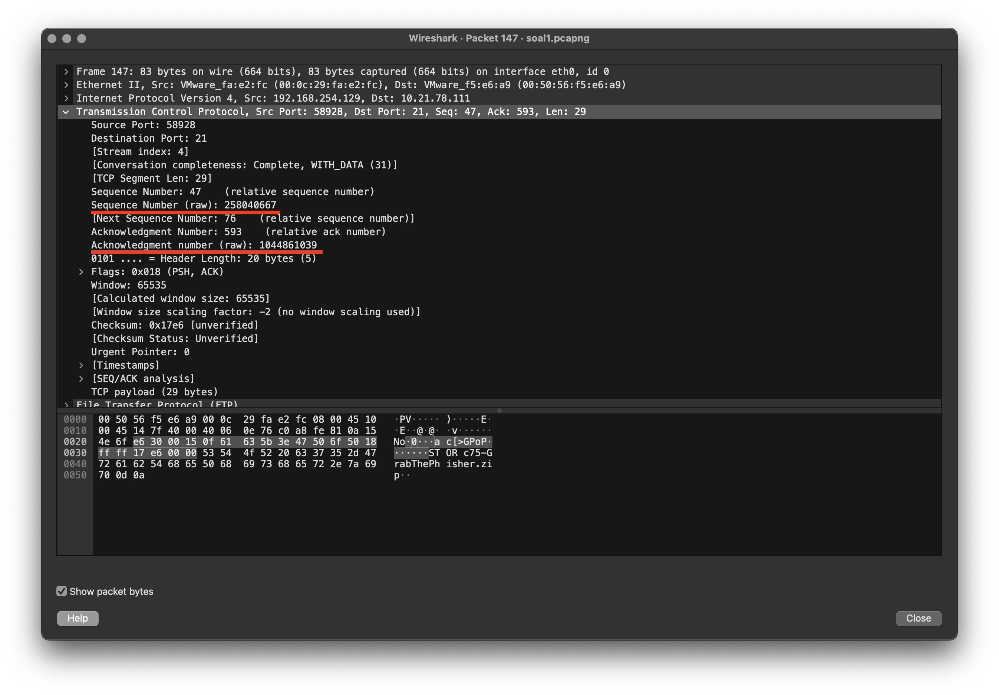

> Respon dari aktivitas berapa tepat dibawah dari packet tersebut, yaitu 148

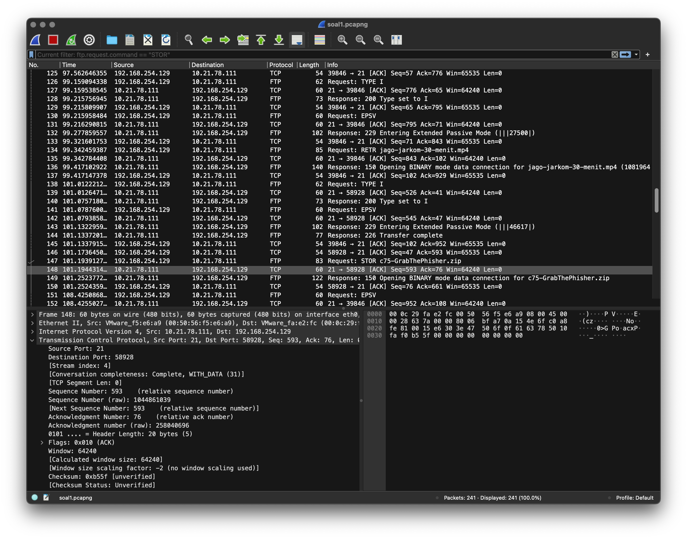

> Sama seperti sebelumnya, sequence number (raw) dan  acknowledge number (raw) dapat didapatkan dengan melihat detail dari packet tersebut

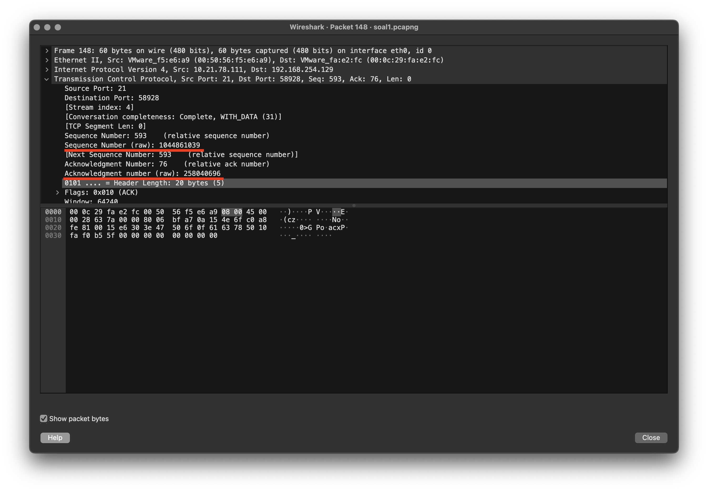


## Soal 2

Sebutkan web server yang digunakan pada portal praktikum Jaringan Komputer!

> gunicorn

<hr style="width:60%;text-align:center">

> Filter packet menggunakan query `http` kemudian follow HTTP Stream lalu search `server`

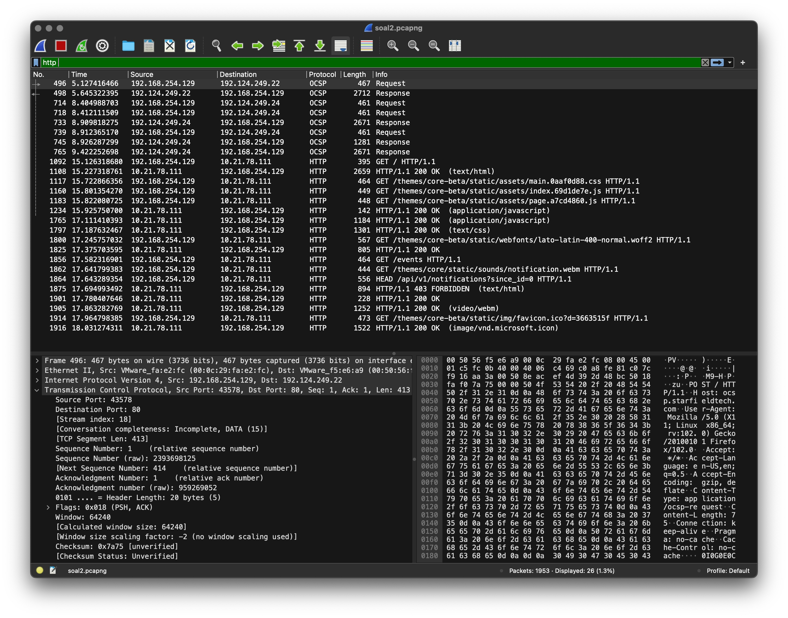

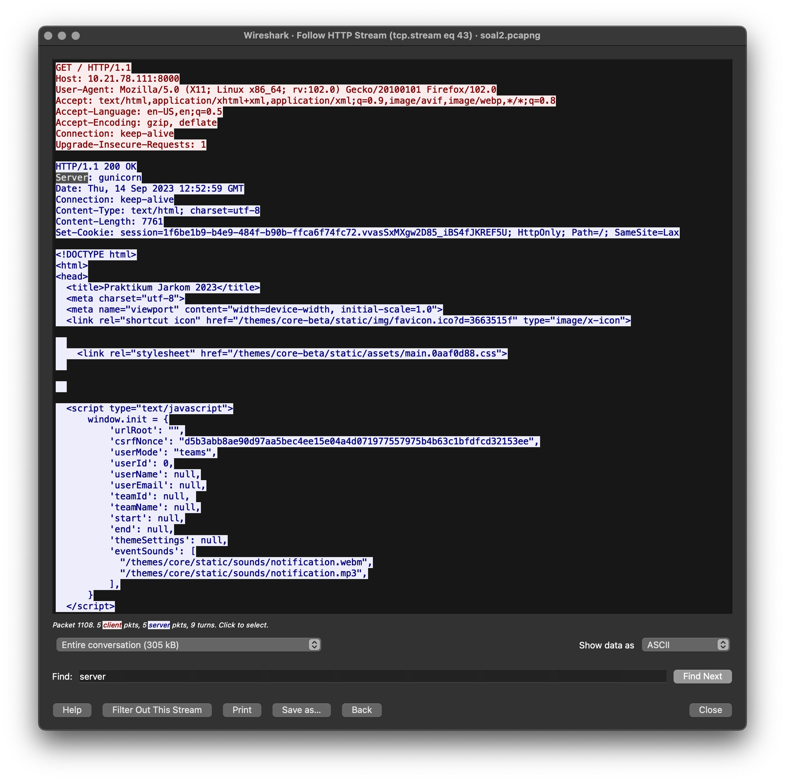

## Soal 3

Dapin sedang belajar analisis jaringan. Bantulah Dapin untuk mengerjakan soal berikut:

<ol type="a">
<li>
    Berapa banyak paket yang tercapture dengan IP source maupun destination address adalah 239.255.255.250 dengan port 3702?
</li>

> 21

<li>
    Protokol layer transport apa yang digunakan?
</li>

> UDP

</ol>

<hr style="width:60%;text-align:center">

> Filter packet dengan menggunakan query:<br>`(tcp.port == 3702 || udp.port == 3702) && (ip.dst==239.255.255.250 || ip.src==239.255.255.250)`

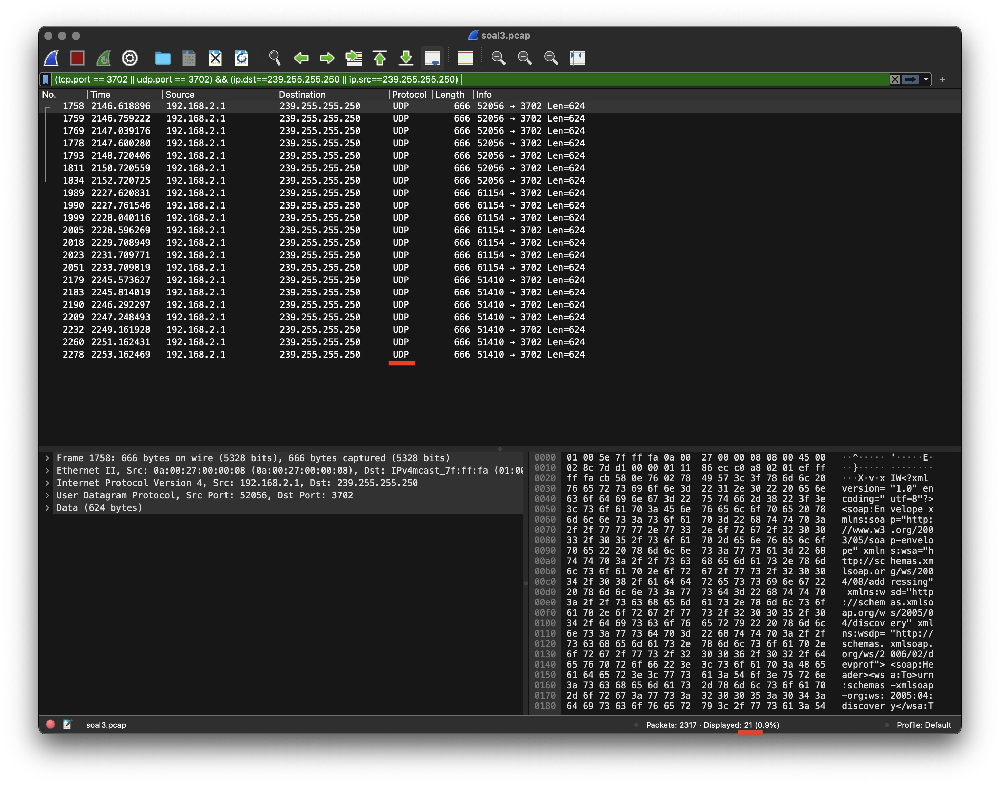

## Soal 4

Berapa nilai checksum yang didapat dari header pada paket nomor 130?

> 0x18e5

<hr style="width:60%;text-align:center">

> Nilai checksum packet 130 dapat dilihat pada detail packet tersebut

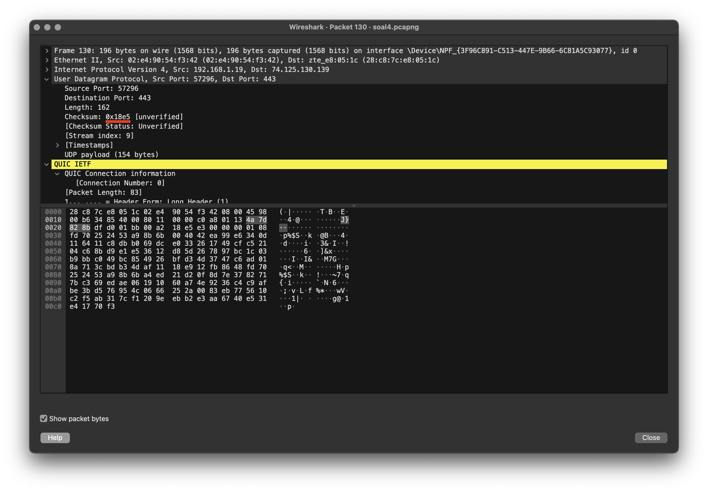

## Soal 5

Elshe menemukan suatu file packet capture yang menarik. Bantulah Elshe untuk menganalisis file packet capture tersebut.

Berapa banyak packet yang berhasil di capture dari file pcap tersebut?

> 60

Port berapakah pada server yang digunakan untuk service SMTP?

> 25

Dari semua alamat IP yang tercapture, IP berapakah yang merupakan public IP?

> 74.53.140.153

<hr style="width:60%;text-align:center">

Pada soal ini, tidak terdapat link netcat namun terdapat file `zippppfileee.zip` dan sebuah `pcap`. File zip yang diberikan merupakan password protected, sehingga diharuskan untuk mendapatkan password dari file `pcap` yang ada.

Pada packet ke-14, terdapat kata pass. Jika packet tersebut di-Follow TCP Stream, terdapat password yang terenkripsi menggunakan Base64 encryption yang nantinya akan menghasilkan `5implePas5word` jika di decode.

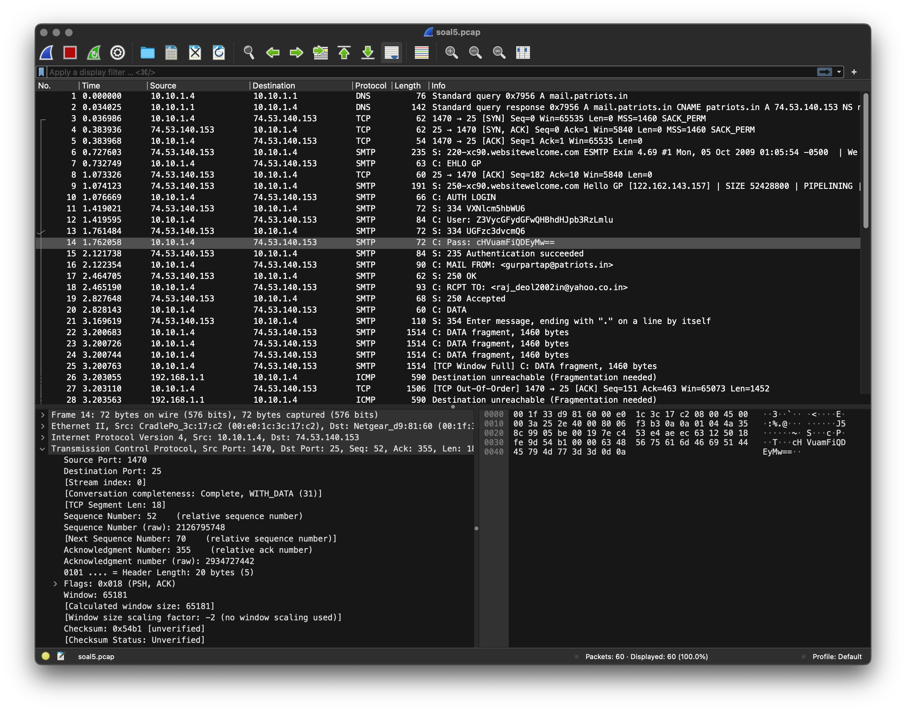

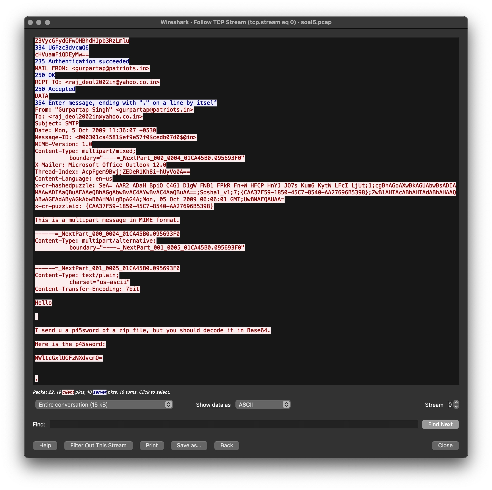

Setelah file `zippppfileee.zip` di-unzip menggunakan password yang didapat, akan muncuk directory `s3crett/connect.txt`. pada txt tersebut berisikan alamat netcat untuk menjawab soal

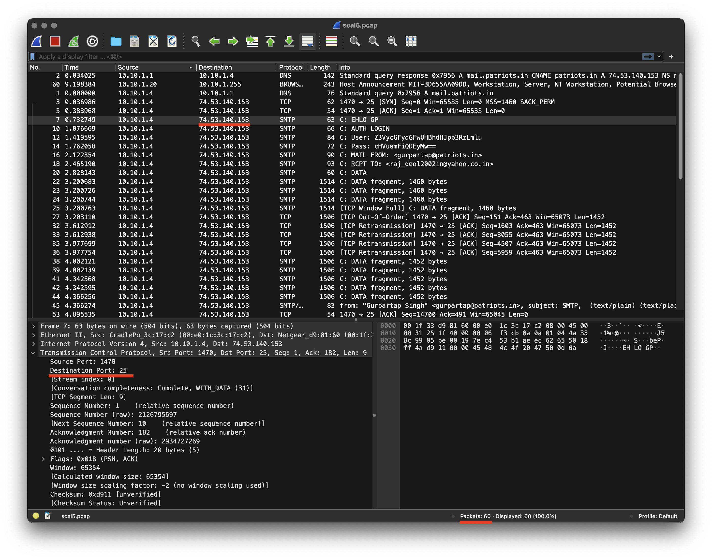

## Soal 6

Seorang anak bernama Udin Berteman dengan SlameT yang merupakan seorang penggemar film detektif. sebagai teman yang baik, Ia selalu mengajak slamet untuk bermain valoranT bersama. suatu malam, terjadi sebuah hal yang tak terdUga. ketika udin mereka membuka game tersebut, laptop udin menunjukkan sebuah field text dan Sebuah kode Invalid bertuliskan <b>"server SOURCE ADDRESS 7812 is invalid".</b> ketika ditelusuri di google, hasil pencarian hanya menampilkan a1 e5 u21. jiwa detektif slamet pun bergejolak. bantulah udin dan slamet untuk menemukan solusi kode error tersebut.
> JDRNJA

<hr style="width:60%;text-align:center">

Informasi yang didapat dari soal:

1. Jika kita mengumpulkan semua Huruf kapital (kecuali "SOURCE ADDRESS") yang ada pada soal, akan terbentuk kata `SUBTITUSI`.
2. Kata `SOURCE ADDRESS` menggunakan kapital semua.
3. Pada soal terpadat angka `7812`.
4. terdapat informasi a1, e5, u21

Dari informasi ke-3, mencoba untuk menuju packet no `7812`, akan didapatkan source adress packet tersebut. Dengan informasi ke-1, kita dapat mencoba untuk subtitusi ip tersebut dengan sebuah huruf. Sesuai dengan informasi ke-4, key dari cipher adalah 0. sehingga didapatkan sebagai berikut:

```txt
104.18.14.101
↓  ↓  ↓  ↓  ↓  ↓    dipisah
10 4  18 14 10 1
↓  ↓  ↓  ↓  ↓  ↓    disubtitusi
J  D  R  N  J  A
```
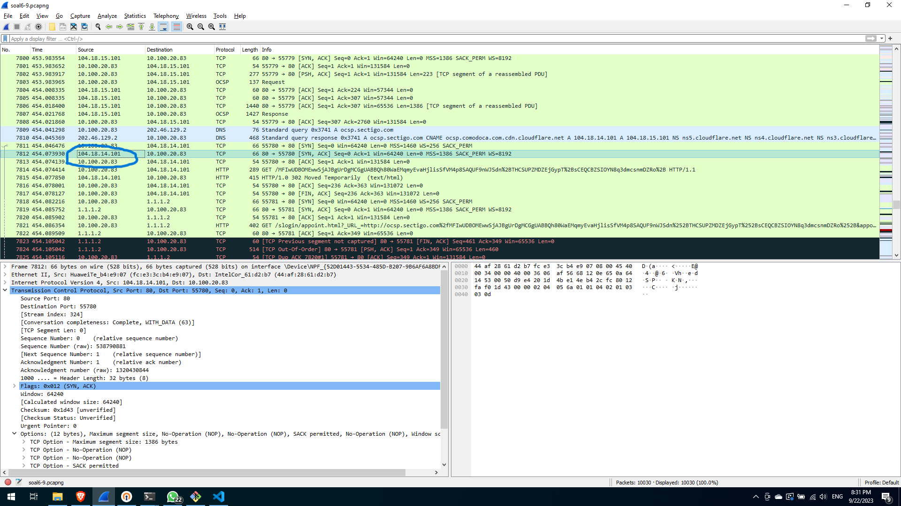

## Soal 7

Berapa jumlah packet yang menuju IP 184.87.193.88?

> 6

<hr style="width:60%;text-align:center">

> Filter packet dengan menggunakan query:<br>`ip.dst == 184.87.193.88`

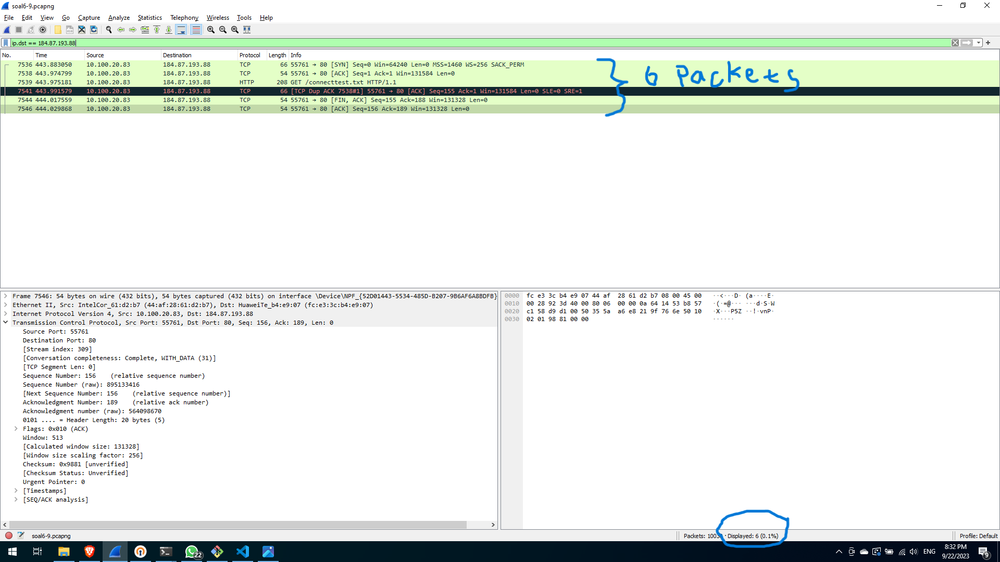

## Soal 8

Berikan kueri filter sehingga wireshark hanya mengambil semua protokol paket yang menuju port 80! (Jika terdapat lebih dari 1 port, maka urutkan sesuai dengan abjad)

> `tcp.dstport == 80 Il udp.dstport == 80`

## Soal 9

Berikan kueri filter sehingga wireshark hanya mengambil paket yang berasal dari alamat 10.51.40.1 tetapi tidak menuju ke alamat 10.39.55.34!

> `ip.src == 10.51.40.1 && ip.dst != 10.39.55.34`

## Soal 10

Sebutkan kredensial yang benar ketika user mencoba login menggunakan Telnet

> `dhafin:kesayangannyak0k0`

<hr style="width:60%;text-align:center">

> Filter packet dengan menggunakan query:<br>`telnet contains ":"`

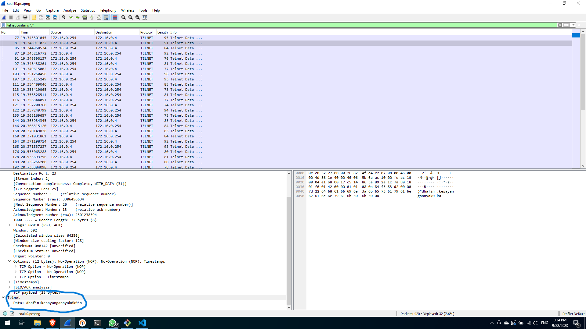
